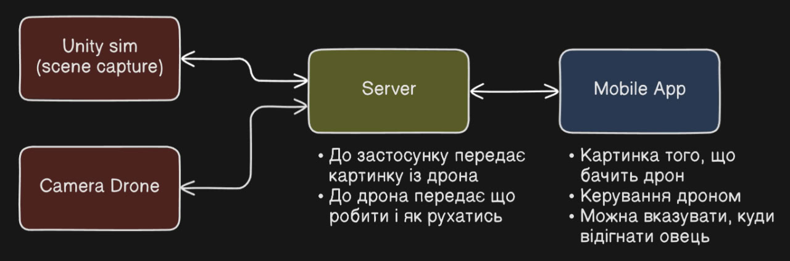

# Super Mega Lviv Hackathon

Чорнетки, спроби і все-все інше

## Складові проєкту

- Презентація
	- Текст виступу
	- Лендінг
	- Дизайн система
- Технічна частина
	- Симуляція
	- Застосунок
	- Дрон із камерою

## Технічна частина

### Симуляція
  - Карта
	  - [5 minute terrain](https://www.youtube.com/watch?v=nCDGjLRecrs)
	  - [terrain asset](https://assetstore.unity.com/packages/3d/environments/unity-terrain-urp-demo-scene-213197)
	  - [sheep model](https://sketchfab.com/baxterbaxter/collections/sheep-91a39abf74924ee69162be9ae78fc381)
  - Симуляція овець
	   - [Herding sheep](https://www.youtube.com/watch?v=44WMyzPyTd0)
  - WiFi сервер

## Презентація

### Текст виступу

- Розказати не про ідею, а про проблему, яку вирішуємо
- Показати, що блін справді воно треба (сошиал пруф, статистика, реальні історії...)

### Лендінг

Схема:

Перший етап:

Схема:

### Дизайн система

Однакові кольори, шрифти, клопки, меню, деталі і у презентації, і на лендінгу, і у застосунку

